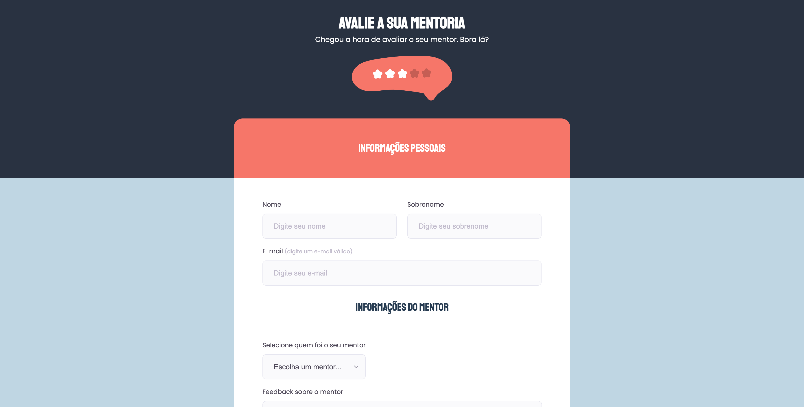

# 6º desafio da formação Explorer

> Projeto desenvolvido - Formulário Avançado - após concluir o conteúdo de formulários do Explorer.

[🔗 Click here to access the website](https://matheusvaz-dev.github.io/forms-advanced-phase-06/)

## 🛠️ Technologies

- HTML (semântica e acessibilidade e formulários);
- CSS (pseudo-classes e seletores avançados).

## 📧 Contact

matheusvaz.ux@gmail.com
